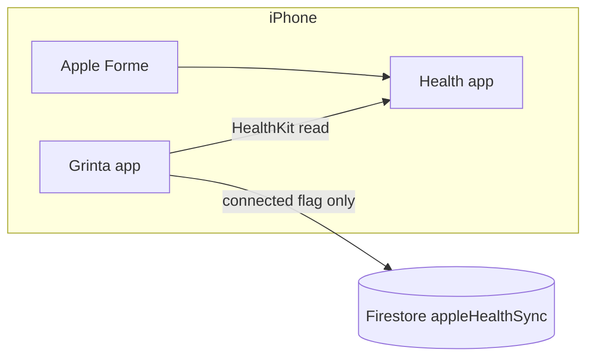

# Apple Health / Apple Forme integration (Phase 1)

Phase 1 delivers **on-device HealthKit connect/disconnect** for Apple Fitness workouts and related metrics. Full workout sync to Firestore and coach roster badges are planned for Phase 2.

> **Related:** Whoop, Strava, Polar, and Fitbit use OAuth cloud APIs. See [Whoop integration](./whoop-integration.md), [Strava integration](./strava-integration.md), [Polar integration](./polar-integration.md), and [Fitbit integration](./fitbit-integration.md). Google Fit on Android uses Health Connect — see [Google Health Connect integration](./google-health-connect-integration.md).

## iOS only — no OAuth cloud API

| Approach | What it is | Phase 1? |
|----------|------------|----------|
| **Apple HealthKit** (this doc) | On-device read access via iOS Health app; Apple Forme workouts stored as Health **Workouts** | **Yes** |
| **Cloud OAuth** (Whoop / Strava / Polar / Fitbit) | Server-side tokens + REST APIs; works on iOS, Android, web | **No** — not applicable to Apple Fitness |

Apple does **not** expose Apple Fitness / Health workout data through a Grinta-style OAuth API. Data lives in the **Health** app on the user's iPhone. Grinta reads it locally with HealthKit after the user grants permission.

- **iOS:** connect via **Sync** in Appareils/Applications → HealthKit authorization prompt
- **Android / web:** Apple Forme option shows an **iOS only** message; Sync is disabled

There is **no** `appleHealthOAuthStart` Cloud Function (unlike `fitbitOAuthStart`, `whoopOAuthStart`, etc.). Firestore stores only connection metadata (`connected`, `lastSyncedAt`, `coachVisibility`) under `users/{uid}/appleHealthSync/{playerId}`.

Phase 2 may add a callable to **upload** synced workouts after they are read on-device.

## Data available (Phase 1 probe)

On connect, Grinta requests read access for:

- **Workouts** (`WORKOUT`) — Apple Forme sessions appear here
- **Heart rate** (`HEART_RATE`)
- **Active energy** (`ACTIVE_ENERGY_BURNED`)
- **Sleep** (`SLEEP_ASLEEP`)

Phase 1 optionally counts workouts from the last 30 days to confirm HealthKit access. **Full sync to Firestore = Phase 2 (TODO).**

## 1. Xcode: enable HealthKit capability

`Info.plist` already includes `NSHealthShareUsageDescription`. You must still enable the capability in Xcode (one-time per developer machine / CI signing setup):

1. Open `ios/Runner.xcworkspace` in Xcode.
2. Select the **Runner** target → **Signing & Capabilities**.
3. Click **+ Capability** → add **HealthKit**.
4. For read-only Phase 1, you do **not** need clinical health records or write access.
5. Confirm `Runner.Runner.entitlements` contains `com.apple.developer.healthkit` (added in repo; Xcode may refresh it when you add the capability).

Build and run on a **physical iPhone** (HealthKit is limited in Simulator).

## 2. Deploy Firestore rules

```bash
firebase deploy --only firestore:rules
```

Rules allow the signed-in user to read/write `users/{uid}/appleHealthSync/{playerId}` (metadata only, no tokens).

## 3. Flutter dependency

The app uses the [`health`](https://pub.dev/packages/health) package (^13.1.4) for HealthKit. No Cloud Functions deploy is required for Phase 1.

```bash
flutter pub get
```

## 4. Test connect / disconnect (iPhone)

### Prerequisites

- Physical iPhone with the **Health** app and at least one **Apple Forme** (or other) workout recorded
- Grinta built from Xcode or `flutter run` on the device

### Player flow

1. Sign in to Grinta and select a player profile.
2. Open **Settings** → **Appareils/Applications**.
3. Select **Apple Forme** / **Apple Fitness** in the dropdown.
4. Tap **Sync** → accept the iOS Health permission sheet (enable **Workouts** and other types).
5. Confirm **Apple Forme** appears under connected devices; badge count increases.
6. Toggle **Coach visibility** (workouts, heart rate, active energy, sleep).
7. Tap **Disconnect** — clears Grinta state only. To fully revoke access: **Settings → Health → Data Access & Devices → Grinta**.

### Coach flow

1. Sign in as a coach with roster access.
2. Open a player's trackers sheet → **Appareils/Applications**.
3. Same connect flow if initiated on the player's device context (coach cannot grant HealthKit on behalf of the athlete).

### Android / web

1. Open Appareils/Applications.
2. Select Apple Forme / Apple Fitness → info text explains **iOS only**; Sync button is disabled.

## 5. Disconnect vs revoke

| Action | Effect |
|--------|--------|
| **Disconnect** in Grinta | Sets `connected: false` in Firestore; clears probe metadata |
| **Revoke in iOS Settings** | Removes HealthKit permission; user should also Disconnect in Grinta |

## 6. Phase 2 (planned)

- [ ] Read workouts + heart rate samples on a schedule
- [ ] Upload normalized sessions to Firestore (optional Cloud Function)
- [ ] Coach roster indicators and training insights

## Architecture summary



OAuth wearables (Whoop, Strava, …) use **Grinta Cloud Functions** for tokens. Apple Health uses **HealthKit on the device only** in Phase 1.
