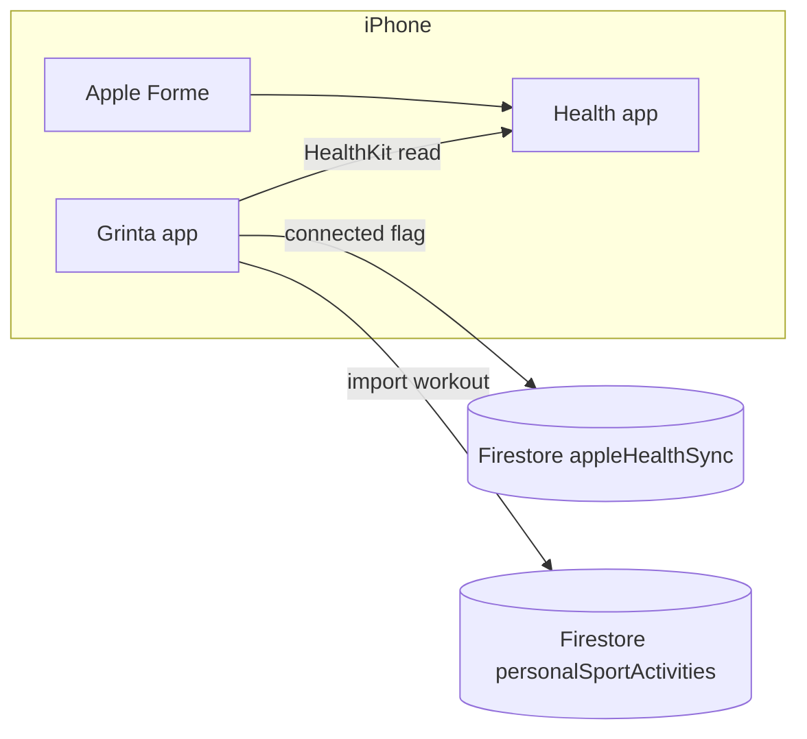

# Apple Health / Apple Forme integration

Apple Fitness workouts are read **on-device via HealthKit** (iOS only). There is no OAuth Cloud Function. Connection metadata lives in Firestore; imported workouts are written client-side into `personalSportActivities`.

> **Related:** Whoop, Strava, Polar, and Fitbit use OAuth cloud APIs. See [Whoop integration](./whoop-integration.md), [Strava integration](./strava-integration.md), [Polar integration](./polar-integration.md), and [Fitbit integration](./fitbit-integration.md). Google Fit on Android uses Health Connect — see [Google Health Connect integration](./google-health-connect-integration.md).

## iOS only — no OAuth cloud API

| Approach | What it is |
|----------|------------|
| **Apple HealthKit** (this doc) | On-device read access via iOS Health app; Apple Forme workouts stored as Health **Workouts** |
| **Cloud OAuth** (Whoop / Strava / Polar / Fitbit) | Server-side tokens + REST APIs; works on iOS, Android, web — **not applicable** to Apple Fitness |

Apple does **not** expose Apple Fitness / Health workout data through a Grinta-style OAuth API. Data lives in the **Health** app on the user's iPhone. Grinta reads it locally with HealthKit after the user grants permission.

- **iOS:** connect via **Sync** in Appareils/Applications → HealthKit authorization prompt
- **Android / web:** Apple Forme option shows an **iOS only** message; Sync is disabled

There is **no** `appleHealthOAuthStart` / `appleHealthListActivities` Cloud Function. Firestore stores:

1. Connection metadata under `users/{uid}/appleHealthSync/{playerId}`
2. Imported sessions under `personalSportActivities` with `externalSource: 'appleHealth'` (same collection as Strava / Polar / Whoop imports)

## Data available

On connect (and when listing importable workouts), Grinta requests read access for:

- **Workouts** (`WORKOUT`) — Apple Forme sessions appear here
- **Heart rate** (`HEART_RATE`) — used for average HR on import when available
- **Active energy** (`ACTIVE_ENERGY_BURNED`)
- **Sleep** (`SLEEP_ASLEEP`)

## Workout import (Créer → activité sportive personnelle)

Same UX as Strava / Polar / Whoop, but **entirely on the client**:

1. Connect Apple Forme in **Appareils / Applications** (iPhone).
2. Agenda → **Créer** → **Une activité sportive personnelle** → uncheck manual entry.
3. Select **Apple Forme** as source → pick a workout from the last ~90 days (already-imported IDs are filtered out).
4. Optionally set feeling / note / visibility → create.

| Field | Source |
|-------|--------|
| `externalSource` | `appleHealth` |
| `externalId` | HealthKit workout UUID (fallback: start epoch + activity type) |
| Duration / distance / pace / calories | HealthKit `WorkoutHealthValue` |
| Average HR | Mean of `HEART_RATE` samples in the workout window |
| `typeId` | Mapped from `HealthWorkoutActivityType` (course, velo, natation, …) |

Dedup uses `PersonalSportActivityService.importedExternalIds` / `hasExternalActivity` with `externalSource: 'appleHealth'`.

Agenda cards show the Apple Forme badge (`assets/images/apple_forme_logo.svg`) when `externalSource == 'appleHealth'`.

**No `firebase deploy` of Cloud Functions is required** for Apple import (unlike Strava / Polar / Whoop).

## Session export (V1) — training / match → Apple Forme

After sensor sync, the **Bilan de séance** screen (`SessionPlayerFeelingScreen`) can write the player's tracker distance + duration into Apple Health:

1. If Apple Forme is **already connected** → export automatically (snackbar confirmation).
2. If **not connected** → dialog *« Souhaites-tu retrouver ces données dans Apple Forme ? »* → Yes connects HealthKit (with write) then exports; No declines for that event.

Feeling is optional and independent. Dedup is stored on `TRACKER_Sync/{eventId}.healthExportPlayers.{playerId}` (`exported` | `declined`).

Requires `NSHealthUpdateUsageDescription` and workout **write** authorization.

## 1. Xcode: enable HealthKit capability

`Info.plist` includes `NSHealthShareUsageDescription` and `NSHealthUpdateUsageDescription` (required by HealthKit / App Store even though Grinta is read-only). You must still enable the capability in Xcode (one-time per developer machine / CI signing setup):

1. Open `ios/Runner.xcworkspace` in Xcode.
2. Select the **Runner** target → **Signing & Capabilities**.
3. Click **+ Capability** → add **HealthKit**.
4. For read-only use, you do **not** need clinical health records or write access.
5. Confirm `Runner.Runner.entitlements` contains `com.apple.developer.healthkit` (added in repo; Xcode may refresh it when you add the capability).

Build and run on a **physical iPhone** (HealthKit is limited in Simulator).

## 2. Deploy Firestore rules

```bash
firebase deploy --only firestore:rules
```

Rules allow the signed-in user to read/write `users/{uid}/appleHealthSync/{playerId}` (metadata only, no tokens) and to write their own `personalSportActivities`.

## 3. Flutter dependency

The app uses the [`health`](https://pub.dev/packages/health) package (^13.1.4) for HealthKit.

```bash
flutter pub get
```

## 4. Test connect + import (iPhone)

### Prerequisites

- Physical iPhone with the **Health** app and at least one **Apple Forme** (or other) workout recorded
- Grinta built from Xcode or `flutter run` on the device

### Player flow — connect

1. Sign in to Grinta and select a player profile.
2. Open **Settings** → **Appareils/Applications** (badge shows the connected count).
3. Tap **+**, select **Apple Forme** / **Apple Fitness** in the type dropdown.
4. Tap **Sync** → accept the iOS Health permission sheet (enable **Workouts** and other types).
5. Confirm **Apple Forme** appears in the connections list; badge count increases.
6. Toggle **Coach visibility** (workouts, heart rate, active energy, sleep).
7. Tap **Disconnect** — clears Grinta state only. To fully revoke access: **Settings → Health → Data Access & Devices → Grinta**.

### Player flow — import workout

1. Agenda → **Créer** → **Une activité sportive personnelle**.
2. Leave **Saisie manuelle** off → choose **Apple Forme**.
3. Select a workout → set feeling / visibility if needed → create.
4. Confirm the agenda card shows metrics + Apple badge; re-opening the import list should omit that workout (dedupe).

### Coach flow

1. Sign in as a coach with roster access.
2. Open a player's trackers sheet → **Appareils/Applications**.
3. Same connect flow if initiated on the player's device context (coach cannot grant HealthKit on behalf of the athlete).

### Android / web

1. Open Appareils/Applications → **+**.
2. Select Apple Forme / Apple Fitness → info text explains **iOS only**; Sync button is disabled.
3. Import source does not appear unless a prior iOS connection left `connected: true` in Firestore; listing then returns an iOS-only error.

## 5. Disconnect vs revoke

| Action | Effect |
|--------|--------|
| **Disconnect** in Grinta | Sets `connected: false` in Firestore; clears probe metadata |
| **Revoke in iOS Settings** | Removes HealthKit permission; user should also Disconnect in Grinta |

## 6. Later enhancements (optional)

- [ ] Background / scheduled read of new workouts
- [ ] Optional Cloud Function to upload normalized sessions from the device
- [ ] Coach roster indicators and training insights beyond agenda cards

## Architecture summary



OAuth wearables (Whoop, Strava, …) use **Grinta Cloud Functions** for tokens and activity fetch. Apple Health uses **HealthKit on the device** for both connect and import.
