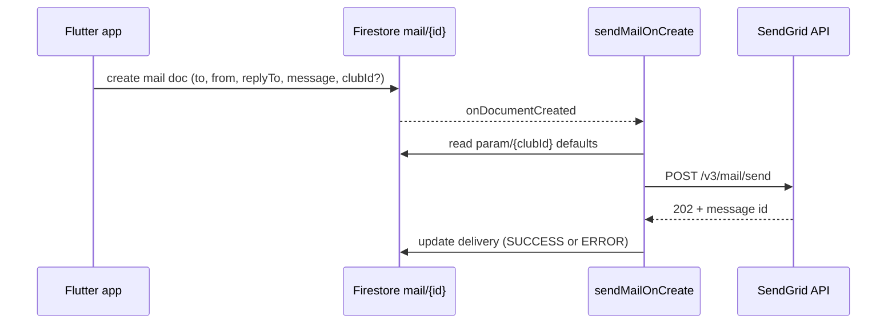

# Email sending (SendGrid Cloud Function)

Grinta queues outbound email by creating documents in the Firestore `mail` collection. The **`sendMailOnCreate`** Cloud Function (region `europe-west1`) sends them via the **SendGrid HTTP API** and writes a `delivery` status back to the same document.

This replaces the Firebase **Trigger Email from Firestore** extension.

## Architecture



## 1. SendGrid API key (Firebase secret)

Create a SendGrid API key with **Mail Send** permission.

From the project root:

```bash
firebase functions:secrets:set SENDGRID_API_KEY
```

Paste the SendGrid API key when prompted. The key is **never** stored in Firestore.

Verify the sender domain or single sender in SendGrid so `fromEmail` addresses are authorized.

## 2. Deploy Cloud Function & Firestore rules

```bash
firebase deploy --only functions:sendMailOnCreate,firestore:rules,storage
```

Or deploy all functions:

```bash
firebase deploy --only functions,firestore:rules,storage
```

## 3. Uninstall Trigger Email extension (migration)

After `sendMailOnCreate` is deployed and tested:

1. Firebase Console → **Extensions** → **Trigger Email from Firestore** → **Uninstall**.
2. Confirm no duplicate sends: only one processor should listen to `mail/{mailId}` creates.
3. Existing `mail` documents with `delivery.state: SUCCESS` from the extension are unchanged; new documents use the Cloud Function.

**Rollback:** Re-install the extension and disable/delete `sendMailOnCreate` if you need to revert (avoid running both at once).

## 4. Configuration

### App invitation defaults (`config/invitation`)

Used by the Flutter app when queuing member invitation emails. Any signed-in user may read; root users may write.

| Field            | Default               | Purpose                          |
|------------------|-----------------------|----------------------------------|
| `fromEmail`      | `noreply@grinta.io`   | Sender on queued mail documents  |
| `replyToEmail`   | `contact@grinta.io`   | Reply-to on queued mail documents|
| `logoUrl`        | Firebase Storage URL  | Logo `` in invitation HTML  |

Seed reference: [`firestore/config/invitation.json`](../firestore/config/invitation.json).

Firebase Console: Firestore → `config/invitation`.

### Invitation email logo (`logoClubs/thumbs/Grinta_1920x1920.png`)

HTML invitation emails embed the logo from `logoUrl`. Email clients load images **without** Firebase auth, so the file must exist in Storage and `logoClubs/{allPaths=**}` must allow **public read** ([`storage.rules`](../storage.rules)).

**Default URL** (path `logoClubs/thumbs/Grinta_1920x1920.png`, bucket `aserstein-2453e.appspot.com`):

```
https://firebasestorage.googleapis.com/v0/b/aserstein-2453e.appspot.com/o/logoClubs%2Fthumbs%2FGrinta_1920x1920.png?alt=media
```

**Upload the logo (one-time):**

1. Firebase Console → **Storage** → bucket `aserstein-2453e.appspot.com`.
2. Ensure folder `logoClubs/thumbs` exists (logo already at `gs://aserstein-2453e.appspot.com/logoClubs/thumbs/Grinta_1920x1920.png`).
3. Deploy storage rules: `firebase deploy --only storage`.
4. Verify in a browser (incognito): open the URL above — you should see the PNG, not JSON `404` or `403`.

**Troubleshooting broken logo in email:**

| Symptom | Fix |
|---------|-----|
| Browser shows `{"error":{"code":404,...}}` | Upload `logoClubs/thumbs/Grinta_1920x1920.png` to Storage |
| Browser shows `403` / permission denied | Deploy [`storage.rules`](../storage.rules) (`allow read: if true` on `logoClubs/{allPaths=**}`) |
| Wrong image | Update `logoUrl` in Firestore `config/invitation` or re-upload the file |
| URL missing `?alt=media` | Use the `?alt=media` download URL format (no auth token) |

Override `logoUrl` in Firestore only if hosting the logo elsewhere (CDN, Firebase Hosting, etc.).

### Club sender defaults (`param/{clubId}`)

Used by the Cloud Function when resolving sender addresses per club/product. Document id = `clubId` (Grinta platform = `"0"`).

| Field           | Default               | Purpose                    |
|-----------------|-----------------------|----------------------------|
| `fromEmail`     | `noreply@grinta.io`   | Default sender for club    |
| `replyToEmail`  | `contact@grinta.io`   | Default reply-to for club  |

Seed reference: [`firestore/config/param-0.json`](../firestore/config/param-0.json) → import as document `param/0`.

**Merge order (Cloud Function):**

1. `mail.from` / `mail.replyTo` on the document (if set) — highest priority
2. `param/{clubId}.fromEmail` / `replyToEmail`
3. Built-in defaults (`noreply@grinta.io`, `contact@grinta.io`)

`clubId` on the mail document defaults to `"0"` when omitted.

## 5. Mail document format

### Create payload (client)

Authenticated users may **create** only. They must **not** set `delivery` (server-only).

```json
{
  "to": "player@example.com",
  "from": "noreply@grinta.io",
  "replyTo": "contact@grinta.io",
  "clubId": "0",
  "message": {
    "subject": "Your Grinta invitation",
    "text": "Plain-text body…",
    "html": "<p>HTML body…</p>"
  },
  "attachments": [
    {
      "content": "<base64>",
      "filename": "report.pdf",
      "type": "application/pdf",
      "disposition": "attachment"
    }
  ]
}
```

`from`, `replyTo`, and `clubId` are optional on create; the app fills them from `config/invitation` for invitations.

`attachments` is optional (max 3). Each entry requires `content` (base64), `filename`, `type`, and `disposition`. Used for session/match PDF reports.

### Delivery update (Cloud Function)

After send attempt, the function updates the same document:

**Success:**

```json
{
  "delivery": {
    "attempts": 1,
    "startTime": "<server timestamp>",
    "endTime": "<server timestamp>",
    "state": "SUCCESS",
    "error": null,
    "leaseExpireTime": null,
    "info": {
      "messageId": "<sendgrid-message-id>",
      "accepted": ["player@example.com"],
      "rejected": [],
      "response": "SendGrid 202"
    }
  }
}
```

**Error:**

```json
{
  "delivery": {
    "attempts": 1,
    "startTime": "<server timestamp>",
    "endTime": "<server timestamp>",
    "state": "ERROR",
    "error": "SendGrid request failed (403): …",
    "leaseExpireTime": null,
    "info": {}
  }
}
```

This mirrors the Trigger Email extension `delivery` shape so existing monitoring or admin tooling can stay compatible.

## 6. Flutter integration

- [`InvitationEmailService`](../lib/services/invitation_email_service.dart) writes to `mail` with `from`, `replyTo`, and `clubId` from [`InvitationConfig.resolve()`](../lib/config/invitation_config.dart).
- [`MemberInvitationService`](../lib/services/member_invitation_service.dart) uses `InvitationEmailService` unchanged (sender fields are resolved inside `send()`).

### Session / match PDF stats reports

Same charter as invitations: branded HTML from shared colors/logo (`InvitationEmailBrand` + `config/invitation`), queued via `mail`, delivered by `sendMailOnCreate`.

| Piece | Role |
|-------|------|
| [`SessionStatsReportService`](../lib/services/session_stats_report_service.dart) | Builds report data from `TRACKER_TeamAnalysis` (Stats tab metrics) |
| [`SessionStatsReportPdfService`](../lib/services/session_stats_report_pdf_service.dart) | Renders PDF bytes |
| [`SessionReportEmailBuilder`](../lib/services/session_report_email_builder.dart) | Subject / text / HTML (same layout as invitations) |
| [`SessionReportSenderService`](../lib/services/session_report_sender_service.dart) | Orchestrates PDF + queue mail with attachment |
| UI | Stats table PDF icon → email dialog; Ask Gio `send_report` action |

**Mail document with PDF attachment:**

```json
{
  "to": "coach@example.com",
  "from": "noreply@grinta.io",
  "replyTo": "contact@grinta.io",
  "clubId": "0",
  "message": {
    "subject": "Grinta Performance — Rapport entraînement : …",
    "text": "…",
    "html": "<!DOCTYPE html>…"
  },
  "attachments": [
    {
      "content": "<base64 PDF>",
      "filename": "grinta_training_….pdf",
      "type": "application/pdf",
      "disposition": "attachment"
    }
  ]
}
```

Ask Gio examples: « envoie-moi le rapport de la séance d'hier », « send today's match report to coach@club.fr ».

**Important — pièce jointe absente dans la boîte mail :**

1. Déploie la Cloud Function à jour (sinon l’ancien processor ignore `attachments`) :
   ```bash
   firebase deploy --only functions:sendMailOnCreate,firestore:rules,storage
   ```
2. Vérifie le doc Firestore `mail/{id}` :
   - champ `attachments` présent (base64) ?
   - `delivery.info.attachmentCount` > 0 après envoi ?
3. L’app upload aussi le PDF dans Storage (`sessionReports/{uid}/…`) et met un bouton **Télécharger le PDF** dans le HTML — ce lien fonctionne même sans pièce jointe SendGrid. Les rapports multi-joueurs (heatmaps) dépassent souvent la limite Firestore (~700 Ko) : dans ce cas seul le lien Storage est envoyé (pas de base64 dans `mail`).
4. Déploie les règles Storage si l’upload échoue avec `unauthorized` :
   ```bash
   firebase deploy --only storage
   ```
5. Si l’extension Firebase **Trigger Email** est encore installée, désinstalle-la pour éviter qu’elle envoie le mail sans pièces jointes.

## 7. Multi-club / white-label

For a club-specific product domain:

1. Create `param/{clubId}` with that club’s `fromEmail` and `replyToEmail`.
2. Queue mail with `"clubId": "<clubId>"` (and optional per-message `from` / `replyTo` overrides).

Grinta app invitations use `clubId: "0"` ([`InvitationConfig.grintaInvitationClubId`](../lib/config/invitation_config.dart)).

## 8. Troubleshooting

| Symptom | Check |
|---------|--------|
| `delivery.state: ERROR`, secret message | `firebase functions:secrets:access SENDGRID_API_KEY` / redeploy function |
| SendGrid 403 | Sender identity verified in SendGrid; `fromEmail` matches verified domain |
| Mail doc created, no `delivery` | Function not deployed, wrong region, or extension still consuming events |
| Duplicate emails | Uninstall Trigger Email extension |
| Broken logo in invitation HTML | Upload `logoClubs/thumbs/Grinta_1920x1920.png`; deploy `storage.rules`; verify URL in browser |

Logs: Firebase Console → Functions → `sendMailOnCreate` → Logs.
