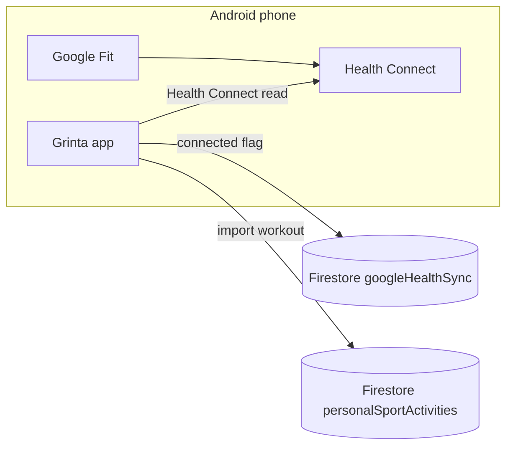

# Google Fit / Health Connect integration

Google Fit workouts are read **on-device via Health Connect** (Android only). There is no OAuth Cloud Function. Connection metadata lives in Firestore; imported workouts are written client-side into `personalSportActivities`.

> **Related:** Whoop, Strava, Polar, and Fitbit use OAuth cloud APIs. See [Whoop integration](./whoop-integration.md), [Strava integration](./strava-integration.md), [Polar integration](./polar-integration.md), and [Fitbit integration](./fitbit-integration.md). Apple Fitness uses HealthKit on iOS — see [Apple Health integration](./apple-health-integration.md).

## Android only — no OAuth cloud API

| Approach | What it is |
|----------|------------|
| **Health Connect** (this doc) | On-device read access via Android Health Connect; Google Fit workouts sync into Health Connect as **Exercise** sessions |
| **Cloud OAuth** (Whoop / Strava / Polar / Fitbit) | Server-side tokens + REST APIs — **not** used for Google Fit on-phone sessions |

Google does **not** expose Google Fit workout data through a Grinta-style OAuth API for on-phone sessions. The **Google Fit** app writes workouts into **Health Connect**. Grinta reads them locally with the [`health`](https://pub.dev/packages/health) package after the user grants permission.

- **Android:** connect via **Sync** in Appareils/Applications → Health Connect authorization prompt
- **iOS / web:** Google Fit / Health Connect option shows an **Android only** message; Sync is disabled

There is **no** `googleHealthOAuthStart` / `googleHealthListActivities` Cloud Function. Firestore stores:

1. Connection metadata under `users/{uid}/googleHealthSync/{playerId}`
2. Imported sessions under `personalSportActivities` with `externalSource: 'googleHealth'`

### Google Fit app vs Health Connect

| Component | Role |
|-----------|------|
| **Google Fit** | User-facing fitness app; records workouts and can sync them into Health Connect |
| **Health Connect** | Android's centralized health data store (built into Android 14+; separate app on Android 9–13) |
| **Grinta** | Reads from Health Connect on-device — does not call Google Fit cloud APIs |

Ensure the athlete has **Google Fit** (or another source app) writing workouts into **Health Connect** before testing.

## Data available

On connect (and when listing importable workouts), Grinta requests read access for:

- **Workouts** (`WORKOUT` → Health Connect **Exercise**)
- **Heart rate** (`HEART_RATE`) — used for average HR on import when available
- **Active energy** (`ACTIVE_ENERGY_BURNED`)
- **Sleep** (`SLEEP_ASLEEP`)

## Workout import (Créer → activité sportive personnelle)

Same UX as Strava / Polar / Whoop / Apple Forme, but **entirely on the client** (Android):

1. Connect Google Fit / Health Connect in **Appareils / Applications**.
2. Agenda → **Créer** → **Une activité sportive personnelle** → uncheck manual entry.
3. Select **Google Fit / Health Connect** as source → pick a workout from the last ~90 days (already-imported IDs are filtered out).
4. Optionally set feeling / note / visibility → create.

| Field | Source |
|-------|--------|
| `externalSource` | `googleHealth` |
| `externalId` | Health Connect workout UUID (fallback: start epoch + activity type) |
| Duration / distance / pace / calories | Health Connect `WorkoutHealthValue` |
| Average HR | Mean of `HEART_RATE` samples in the workout window |
| `typeId` | Mapped from `HealthWorkoutActivityType` (course, velo, natation, …) |

Dedup uses `PersonalSportActivityService.importedExternalIds` / `hasExternalActivity` with `externalSource: 'googleHealth'`.

Agenda cards show the Google Fit badge (`assets/images/google_fit_logo.svg`) when `externalSource == 'googleHealth'`.

**No `firebase deploy` of Cloud Functions is required** for Google Fit import (unlike Strava / Polar / Whoop).

## Session export (V1) — training / match → Google Fit

After sensor sync, the **Bilan de séance** screen can write the player's tracker distance + duration into Health Connect:

1. If Google Fit / Health Connect is **already connected** → export automatically.
2. If **not connected** → dialog *« Souhaites-tu retrouver ces données dans Google Fit ? »* → Yes connects then exports.

Manifest needs `WRITE_EXERCISE` / `WRITE_DISTANCE` (and calories write if requested by the plugin). Dedup uses `TRACKER_Sync/{eventId}.healthExportPlayers.{playerId}`.

## 1. Android: manifest and MainActivity

The repo includes Health Connect setup in `android/app/src/main/AndroidManifest.xml`:

- Read permissions: `READ_EXERCISE`, `READ_HEART_RATE`, `READ_ACTIVE_CALORIES_BURNED`, `READ_SLEEP`
- Write permissions (session export V1): `WRITE_EXERCISE`, `WRITE_DISTANCE`, `WRITE_TOTAL_CALORIES_BURNED`
- `ACTIVITY_RECOGNITION` (required for fitness data)
- `<queries>` for `com.google.android.apps.healthdata`
- Permissions rationale intent-filter and `ViewPermissionUsageActivity` activity-alias

`MainActivity` extends `FlutterFragmentActivity` (required by the `health` package for Health Connect permission flows).

### minSdk

Grinta `minSdk` is **23**. Health Connect requires the Health Connect app (Android 9–13) or system integration (Android 14+). Test on a physical device with Health Connect available.

## 2. Deploy Firestore rules

```bash
firebase deploy --only firestore:rules
```

Rules allow the signed-in user to read/write `users/{uid}/googleHealthSync/{playerId}` (metadata only, no tokens) and to write their own `personalSportActivities`.

## 3. Flutter dependency

The app uses the [`health`](https://pub.dev/packages/health) package (^13.1.4) for Health Connect.

```bash
flutter pub get
```

## 4. Test connect + import (Android)

### Prerequisites

- Physical Android device with **Health Connect** installed (or Android 14+)
- **Google Fit** (or another app) with at least one workout synced into Health Connect
- Grinta built with `flutter run` on the device

### Player flow — connect

1. Sign in to Grinta and select a player profile.
2. Open **Grinta** avatar → **Réglages** → **Appareils/Applications** (not Android system Settings).
3. Tap **+**, select **Google Health**.
4. Tap **Sync**.
5. Android may ask for **Activity recognition** / **Location** first (needed for workouts).
6. Then the **Health Connect** permission sheet should open — enable **Exercise** (and heart rate / energy / sleep if offered).
7. Confirm **Grinta** appears under the **Health Connect** app → **App permissions** (not under Google Fit’s “connected apps” list).
8. Toggle **Coach visibility** (workouts, heart rate, active energy, sleep).
9. Tap **Disconnect** — clears Grinta state only. To fully revoke: **Health Connect → App permissions → Grinta**.

If Sync does **not** show the Health Connect sheet:

| Cause | What Grinta does / what to do |
|-------|-------------------------------|
| Health Connect missing (Android 9–13) or outdated | Grinta opens Play Store via `installHealthConnect`; install/update, then Sync again |
| Runtime permissions skipped previously | Rebuild with current Sync flow (requests Activity Recognition + location before HC) |
| Sheet dismissed / denied | Open **Health Connect** app → App permissions → enable Grinta manually |

### Player flow — import workout

1. Agenda → **Créer** → **Une activité sportive personnelle**.
2. Leave **Saisie manuelle** off → choose **Google Fit / Health Connect**.
3. Select a workout → set feeling / visibility if needed → create.
4. Confirm the agenda card shows metrics + Google Fit badge; re-opening the import list should omit that workout (dedupe).

### iOS / web

1. Open Appareils/Applications → **+**.
2. Select Google Fit / Health Connect → **Android only** message; Sync disabled.

## 5. Disconnect vs revoke

| Action | Effect |
|--------|--------|
| **Disconnect** in Grinta | Sets `connected: false` in Firestore; clears probe metadata |
| **Revoke in Health Connect** | Removes app permissions; user should also Disconnect in Grinta |

## 5b. Troubleshooting — « Aucune activité » / empty import list

Grinta does **not** call Google Fit cloud APIs. An empty list almost always means Health Connect on **this phone** has no Exercise sessions Grinta can read.

| Situation | What happens | What to do |
|-----------|--------------|------------|
| Workouts recorded on **another phone/watch** | Cloud Fit history is not auto-visible to Grinta | On the phone running Grinta: install/open **Google Fit**, sign in with the **same Google account**, wait for sync, confirm Fit can **write** Exercise into **Health Connect** |
| Different **Google account** on this phone | Health Connect holds data for the accounts/apps on this device | Switch Google Fit (and the phone’s primary Google account if needed) to the account that owns the workouts |
| Fit not writing to Health Connect | Grinta has nothing to read | **Health Connect → App permissions → Google Fit** → allow Exercise (and related) write; then **Health Connect → App permissions → Grinta** → allow Exercise read |
| Session older than ~90 days | Outside import lookback | Record/sync a more recent workout, or recreate one in Fit |
| Permissions incomplete | Connect may succeed with `recentWorkoutCount: 0` | Re-run Sync and enable **Exercise** for Grinta |

After connect, if Health Connect authorization succeeds but the local probe finds **0 workouts**, Grinta still marks the link as connected and surfaces a **no workouts on this device** message (snackbar + Devices list subtitle).

## 6. Later enhancements (optional)

- [ ] Background / scheduled read of new workouts
- [ ] Optional Cloud Function to upload normalized sessions from the device
- [ ] Coach roster indicators beyond agenda cards

## Architecture summary



OAuth wearables (Whoop, Strava, …) use **Grinta Cloud Functions** for tokens and activity fetch. Google Fit uses **Health Connect on the device** for both connect and import.
