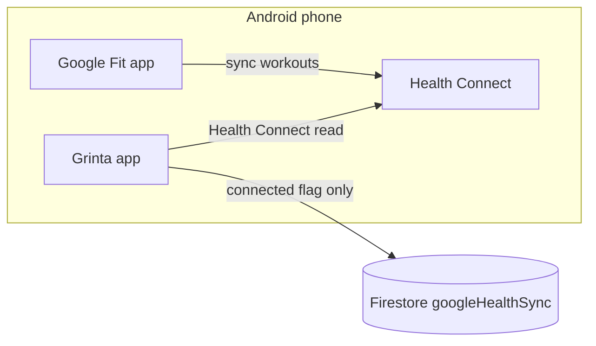

# Google Fit / Health Connect integration (Phase 1)

Phase 1 delivers **on-device Health Connect connect/disconnect** for Google Fit workouts and related metrics. Full workout sync to Firestore and coach roster badges are planned for Phase 2.

> **Related:** Whoop, Strava, Polar, and Fitbit use OAuth cloud APIs. See [Whoop integration](./whoop-integration.md), [Strava integration](./strava-integration.md), [Polar integration](./polar-integration.md), and [Fitbit integration](./fitbit-integration.md). Apple Fitness uses HealthKit on iOS — see [Apple Health integration](./apple-health-integration.md).

## Android only — no OAuth cloud API

| Approach | What it is | Phase 1? |
|----------|------------|----------|
| **Health Connect** (this doc) | On-device read access via Android Health Connect; Google Fit workouts sync into Health Connect as **Exercise** sessions | **Yes** |
| **Cloud OAuth** (Whoop / Strava / Polar / Fitbit) | Server-side tokens + REST APIs; works on iOS, Android, web | **No** — not applicable to Google Fit on-device data |

Google does **not** expose Google Fit workout data through a Grinta-style OAuth API for on-phone sessions. The **Google Fit** app writes workouts and metrics into **Health Connect** on the user's Android device. Grinta reads them locally with the [`health`](https://pub.dev/packages/health) package after the user grants permission.

- **Android:** connect via **Sync** in Appareils/Applications → Health Connect authorization prompt
- **iOS / web:** Google Fit / Health Connect option shows an **Android only** message; Sync is disabled

There is **no** `googleHealthOAuthStart` Cloud Function (unlike `fitbitOAuthStart`, `whoopOAuthStart`, etc.). Firestore stores only connection metadata (`connected`, `lastSyncedAt`, `coachVisibility`) under `users/{uid}/googleHealthSync/{playerId}`.

Phase 2 may add a callable to **upload** synced workouts after they are read on-device.

### Google Fit app vs Health Connect

| Component | Role |
|-----------|------|
| **Google Fit** | User-facing fitness app; records workouts and can sync them into Health Connect |
| **Health Connect** | Android's centralized health data store (built into Android 14+; separate app on Android 9–13) |
| **Grinta** | Reads from Health Connect on-device — does not call Google Fit cloud APIs |

Ensure the athlete has **Google Fit** (or another source app) writing workouts into **Health Connect** before testing.

## Data available (Phase 1 probe)

On connect, Grinta requests read access for:

- **Workouts** (`WORKOUT` → Health Connect **Exercise**)
- **Heart rate** (`HEART_RATE`)
- **Active energy** (`ACTIVE_ENERGY_BURNED`)
- **Sleep** (`SLEEP_ASLEEP`)

Phase 1 optionally counts workouts from the last 30 days to confirm Health Connect access. **Full sync to Firestore = Phase 2 (TODO).**

## 1. Android: manifest and MainActivity

The repo includes Health Connect setup in `android/app/src/main/AndroidManifest.xml`:

- Read permissions: `READ_EXERCISE`, `READ_HEART_RATE`, `READ_ACTIVE_CALORIES_BURNED`, `READ_SLEEP`
- `ACTIVITY_RECOGNITION` (required for fitness data)
- `<queries>` for `com.google.android.apps.healthdata`
- Permissions rationale intent-filter and `ViewPermissionUsageActivity` activity-alias

`MainActivity` extends `FlutterFragmentActivity` (required by the `health` package for Health Connect permission flows).

### minSdk

Grinta `minSdk` is **23**. Health Connect requires the Health Connect app (Android 9–13) or system integration (Android 14+). Test on a physical device with Health Connect available.

## 2. Deploy Firestore rules

```bash
firebase deploy --only firestore:rules
```

Rules allow the signed-in user to read/write `users/{uid}/googleHealthSync/{playerId}` (metadata only, no tokens).

## 3. Flutter dependency

The app uses the [`health`](https://pub.dev/packages/health) package (^13.1.4) for Health Connect. No Cloud Functions deploy is required for Phase 1.

```bash
flutter pub get
```

## 4. Test connect / disconnect (Android)

### Prerequisites

- Physical Android device with **Health Connect** installed (or Android 14+)
- **Google Fit** (or another app) with at least one workout synced into Health Connect
- Grinta built with `flutter run` on the device

### Player flow

1. Sign in to Grinta and select a player profile.
2. Open **Settings** → **Appareils/Applications** (badge shows the connected count).
3. Tap **+**, select **Google Fit / Health Connect** in the type dropdown.
4. Tap **Sync** → accept the Health Connect permission sheet (enable **Exercise**, heart rate, etc.).
5. Confirm **Google Fit / Health Connect** appears in the connections list; badge count increases.
6. Toggle **Coach visibility** (workouts, heart rate, active energy, sleep).
7. Tap **Disconnect** — clears Grinta state only. To fully revoke access: **Health Connect → App permissions → Grinta**.

### Coach flow

1. Sign in as a coach with roster access.
2. Open a player's trackers sheet → **Appareils/Applications**.
3. Same connect flow if initiated on the player's device context (coach cannot grant Health Connect on behalf of the athlete).

### iOS / web

1. Open Appareils/Applications → **+**.
2. Select Google Fit / Health Connect → info text explains **Android only**; Sync button is disabled.

## 5. Disconnect vs revoke

| Action | Effect |
|--------|--------|
| **Disconnect** in Grinta | Sets `connected: false` in Firestore; clears probe metadata |
| **Revoke in Health Connect** | Removes app permissions; user should also Disconnect in Grinta |

## 6. Phase 2 (planned)

- [ ] Read workouts + heart rate samples on a schedule
- [ ] Upload normalized sessions to Firestore (optional Cloud Function)
- [ ] Coach roster indicators and training insights

## Architecture summary



OAuth wearables (Whoop, Strava, Fitbit, …) use **Grinta Cloud Functions** for tokens. Google Fit / Health Connect uses **Health Connect on the device only** in Phase 1.
