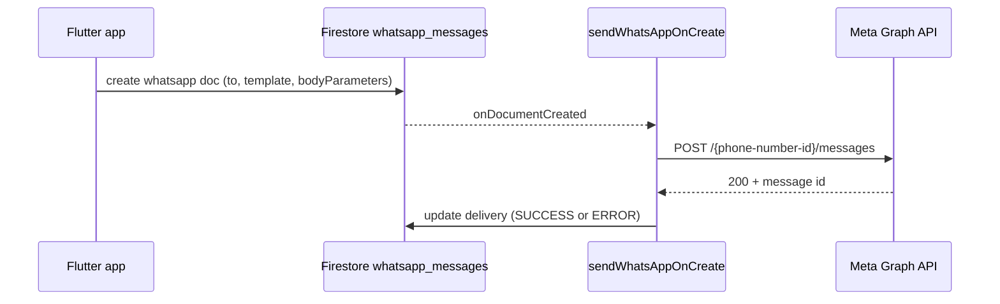

# WhatsApp invitations (Meta Cloud API)

Grinta queues outbound WhatsApp **template** messages by creating documents in the Firestore `whatsapp_messages` collection. The **`sendWhatsAppOnCreate`** Cloud Function (region `europe-west1`) sends them via the **Meta WhatsApp Cloud API** and writes a `delivery` status back to the same document.

Business-initiated invites require a **Meta-approved message template** (App Review / WhatsApp Business). Until the template is approved, the Cloud Function still runs but Meta returns an error recorded in `delivery`.

## Architecture



## 1. Meta / WhatsApp Business setup

1. Create a [Meta Business](https://business.facebook.com/) + WhatsApp Business Account.
2. In Meta Developer → your app → **WhatsApp** → API Setup:
   - Copy **Phone number ID**
   - Generate a permanent **System User** access token with `whatsapp_business_messaging`
3. Create a template named **`member_invitation`** (or override via config) in languages you need (`fr`, `en`, …).

### Suggested template body (3 variables)

```
Your coach invites you to join {{1}}. Your code: {{2}}. Join: {{3}}
```

French example:

```
Ton coach t'invite à rejoindre {{1}}. Ton code : {{2}}. Rejoins : {{3}}
```

Body parameters sent by the app:

1. App display name (`Grinta Performance`)
2. Invitation code (`GT1234`)
3. Invite URL (`https://grinta.io/invite?code=GT1234`)

Submit the template for Meta approval (can take from minutes to a few business days).

## 2. Firebase secrets

```bash
firebase functions:secrets:set WHATSAPP_ACCESS_TOKEN
firebase functions:secrets:set WHATSAPP_PHONE_NUMBER_ID
firebase functions:secrets:set WHATSAPP_VERIFY_TOKEN
```

`WHATSAPP_VERIFY_TOKEN` is an arbitrary string you choose for the webhook handshake.

## 3. Deploy

```bash
firebase deploy --only functions:sendWhatsAppOnCreate,functions:whatsappWebhook,firestore:rules
```

Configure the webhook URL in Meta:

```
https://europe-west1-<project-id>.cloudfunctions.net/whatsappWebhook
```

Use the same verify token as `WHATSAPP_VERIFY_TOKEN`. Subscribe to `messages` if Meta asks (inbound events are acknowledged and lightly logged).

## 4. App / Firestore config (`config/invitation`)

| Field | Default | Purpose |
|-------|---------|---------|
| `inviteBaseUrl` | `https://grinta.io/invite` | Public invite landing URL |
| `whatsappTemplateName` | `member_invitation` | Approved template name |
| `whatsappTemplateLanguage` | `fr` | Template language code |
| `whatsappApiVersion` | `v21.0` | Graph API version (optional override on docs) |

Seed: [`firestore/config/invitation.json`](../firestore/config/invitation.json).

## 5. Document format

```json
{
  "to": "+33612345678",
  "templateName": "member_invitation",
  "languageCode": "fr",
  "bodyParameters": [
    "Grinta Performance",
    "GT1234",
    "https://grinta.io/invite?code=GT1234"
  ],
  "clubId": "0",
  "kind": "member_invitation",
  "invitationId": "<uuid>",
  "invitationCode": "GT1234"
}
```

`delivery` is written only by the Cloud Function (same shape as email).

## 6. Flutter integration

- [`InvitationWhatsAppService`](../lib/services/invitation_whatsapp_service.dart) queues documents.
- [`MemberInvitationService`](../lib/services/member_invitation_service.dart) sends WhatsApp when the roster member has a valid E.164 phone (in addition to email when present).
- Invite with **email and/or phone** (at least one contact channel).

## 7. Fallback without Meta approval

Coaches can still open a prefilled WhatsApp chat via `wa.me` (no Business API) using [`InvitationLinkBuilder.waMeUri`](../lib/services/invitation_link_builder.dart). Auto-send via Cloud API becomes active once secrets + template approval are in place.

## 8. Troubleshooting

| Symptom | Check |
|---------|--------|
| `delivery.state: ERROR`, secrets message | Set secrets and redeploy |
| Meta 132001 / template not found | Template name/language mismatch or not approved |
| Meta 131047 | Recipient has not opted in / quality issues — verify WABA status |
| Doc created, no `delivery` | Function not deployed or wrong region |

Logs: Firebase Console → Functions → `sendWhatsAppOnCreate`.
